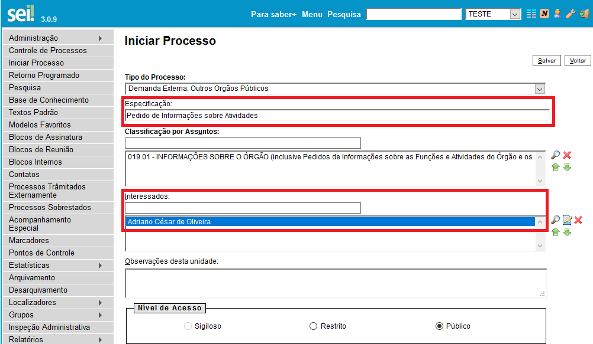
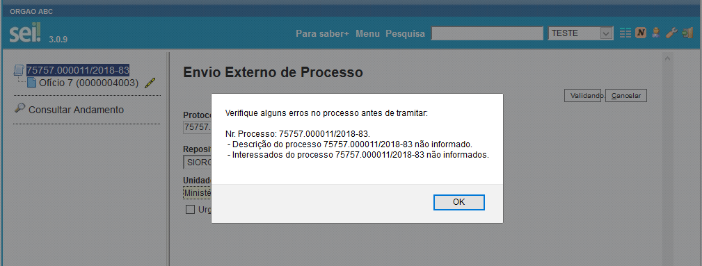
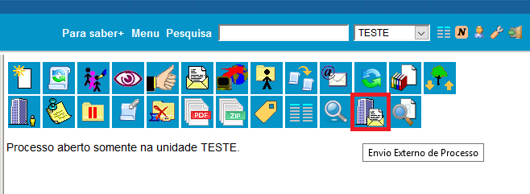
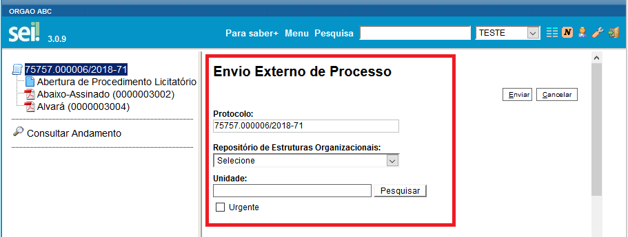
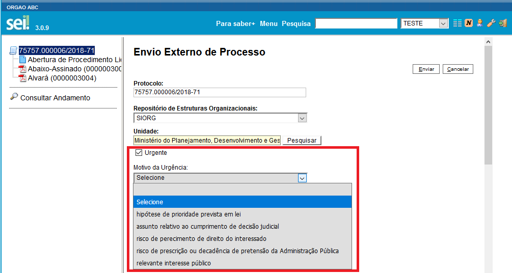
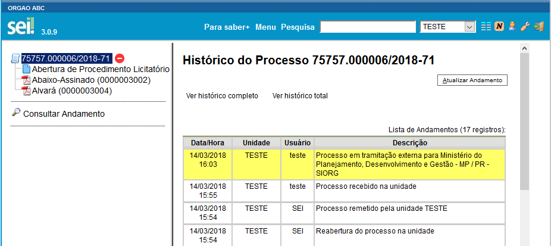
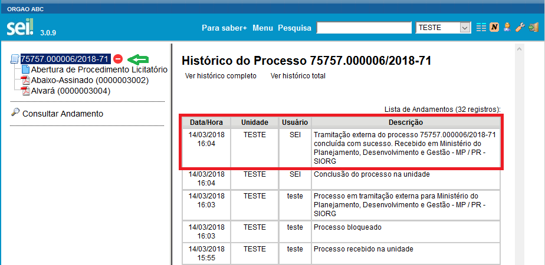
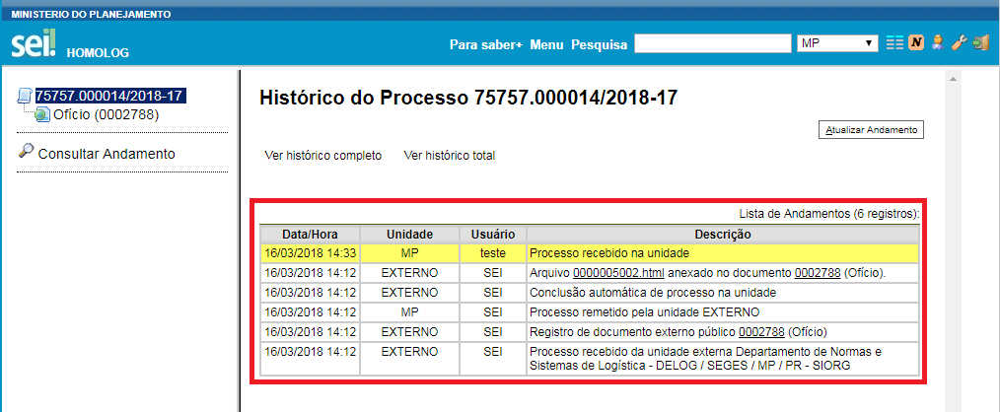
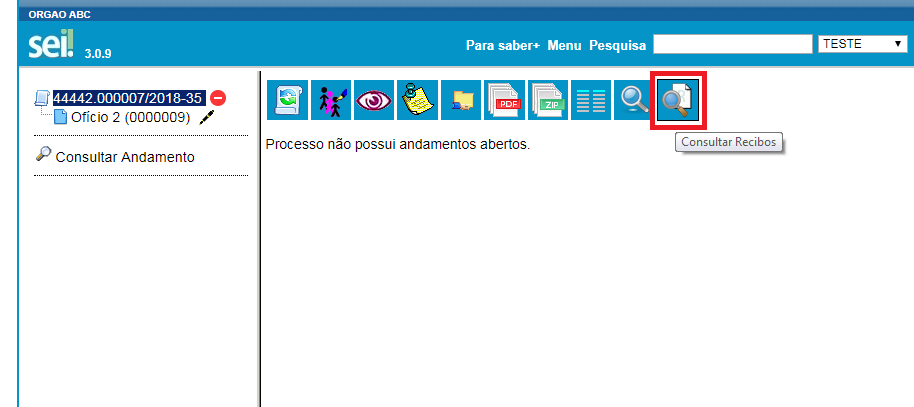
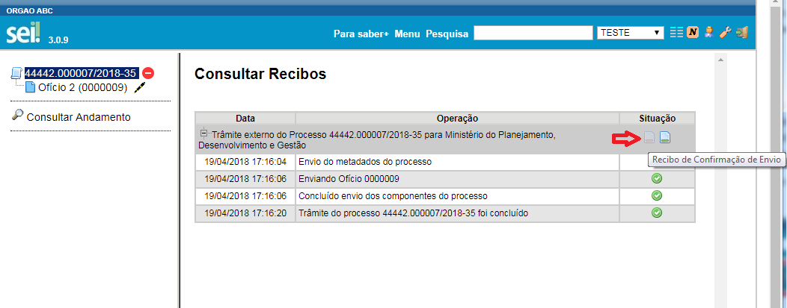

# Módulo de Integração do Processo Eletrônico Nacional - PEN

O módulo **PEN** é o responsável por integrar o Sistema Eletrônico de Informações - SEI à plataforma de interoperabilidade do Processo Eletrônico Nacional - PEN. Este projeto tem como objetivo interligar todos os sistema de processo eletrônico do Poder Executivo Federal a fim de proporcionar a troca de documentos oficiais de forma rápida, simplificada e segura.

A utilização deste módulo adicionará novas funcionalidades ao SEI, permitindo, entre outros:
 - Enviar e receber processos administrativos de outras instituições
 - Acompanhar a relação de processos em trâmite externo
 
Para maiores informações sobre o Barramento de Serviços e o PEN, acesse http://processoeletronico.gov.br/index.php/assuntos/produtos/barramento.

## Manual de Utilização

Esta seção tem por objetivo demonstrar as funcionalidades que são disponibilizadas pelo módulo de integração do SEI com o Barramento de Serviços do PEN e também as configurações que devem ser realizadas no próprio SEI para o correto funcionamento.

### Informações Obrigatórias para Envio Externo de Processo

O **Barramento-PEN** atende a diferentes sistemas informatizados de gestão arquivística de documentos (SIGAD). 

Para permitir a interoperabilidade entre estes tipos de sistemas, definiu-se um padrão de dados para intercâmbio. Este padrão define atributos que são obrigatórios e/ou opcionais. A obrigatoriedade de alguns elementos obriga que determinadas informações sejam incluídas no processo, as quais, no SEI, originalmente, são opcionais.

Ao criar o processo, para envio externo pelo PEN, são obrigatórios os campos **especificação e interessado** (deve haver pelo menos um interessado no processo)

O SEI fará uma verificação das informações pendentes para envio e exibirá uma mensagem para o usuário, conforme imagem:

Verifica-se também se o processo possui pelo menos um documento interno assinado ou se possui algum documento externo, além de impedir o trâmite de processos que possuam documentos sem assinatura, conforme exemplificado a seguir:

### Envio Externo de Processo

Para realizar o trâmite externo do processo, o módulo disponibiliza ao usuário (**caso o seu perfil possua o recurso pen\_procedimento\_expedir**) um ícone na tela de processos, conforme imagem abaixo: 

Ao acionar o ícone de envio externo de processo, disponibiliza-se uma tela onde mostra-se o número do processo selecionado para envio externo, que é apenas informativo, a opção de escolha do repositório de estruturas do receptor (que no caso do Poder Executivo Federal será o do SIORG -  Sistema de Organização e Inovação Institucional do Governo Federal), o nome da unidade receptora na estrutura organizacional e opção de indicar se trata-se de processo com urgência.

O cadastro da estrutura organizacional é feito previamente no Portal de Administração do Barramento - PEN. A administração central do portal é feita pela equipe do Ministério da Economia - ME, embora o cadastro da estrutura propriamente dita seja feito por um perfil denominado Comitê Gestor de Protocolo, informado pelo órgão ou entidade e habilitado no portal pela equipe do MP, conforme [fluxo definido](http://processoeletronico.gov.br/images/portal/fluxo-de-adesao_sei-2.png).

Para maiores informações sobre o Comitê Gestor de Protocolo, consulte o [manual específico](http://processoeletronico.gov.br/images/documentacao/Manual_do_Barramento_PEN_GESTOR7rdz.pdf). 
Todos os detalhes do procedimento de adeção também podem ser encontrados na seção "Como Aderir" no site do Processo Eletrônico Nacional. Link: http://processoeletronico.gov.br/index.php/assuntos/produtos/barramento/como-aderir-barramento

O Barramento de Serviços do PEN permite a participação de órgãos e entidades de outros poderes e esferas administrativas, sendo no Poder Executivo Federal o uso obrigatório do SIORG, conforme parágrafo único do Art. 25, do [Decreto nº 6.944, de 21 de agosto de 2009](http://www.planalto.gov.br/ccivil_03/_Ato2007-2010/2009/Decreto/D6944.htm).   

Ao selecionar o repositório de estruturas desejado, é necessário digital o nome da unidade administrativa receptora do processo. Dinamicamente, sugere-se o nome da unidade, baseado na configuração feita no Portal de Administração do PEN. **As unidades disponíveis para envio externo dependem da configuração realizada por cada Comitê Gestor de Protocolo dos órgãos e entidades.**

Na tela de envio externo de processo, há a opção de indicar a **urgência** para o processo. As opções são automaticamente sincronizadas a partir do serviço do PEN.

Ao realizar o envio externo, o módulo faz uma **série de validações no processo** para que a informação seja corretamente enviada ao serviço do PEN. O andamento do progresso de validação e envio é exibido por meio de uma janela *pop-up* do navegador web. É importante permitir a abertura de *pop-ups* no navegador web, para que a operação possa ser verificada.

Uma vez que o processo tenha sido recebido com sucesso pelo PEN, a seguinte mensagem é exibida. **Mas isso não significa que a unidade destinatária recebeu e aceitou o processo, pois esta também deve fazer uma série de validações,** conforme explicado na próxima seção.

### Informações Registradas nos Andamentos do Processo (Histórico)

O Barramento de Serviços do PEN atua como uma **terceiro confiável** no trâmite do processo administrativo. Em um primeiro momento, o módulo do SEI faz uma série de validações de informações constantes do processo a ser enviado. Uma vez validadas estas informações, a operação de envio é registrada no andamento do processo. **Mas isso ainda não reflete o sucesso no trâmite de fato**, pois a unidade receptora também faz uma série de validações como, por exemplo, os tamanhos de documentos que tem capacidade de receber, as espécies documentais, hipóteses legais, dentre outras. Uma vez validados, na origem, os requisitos para envio externo,** registra-se no andamento do processo a operação de envio** por meio do Barramento, conforme o seguinte exemplo:

Enquanto a unidade receptora não confirma o recebimento, o SEI passa a indicar que aquele processo **encontra-se em envio externo**, aguardando o recebimento. Nesse momento, o processo encontra-se bloqueado para edição, evento que possui um alerta de um círculo vermelho à direita do seu número, na tela de Controle do Processo. No estado bloqueado, as opções disponíveis são **apenas de visualização**, sem permitir operações que alteram informações do processo.

O SEI, ao receber o aviso do Barramento de Serviços do PEN de que a unidade receptora validou as informações e recebeu o processo, faz o registro no andamento, indicando o sucesso no trâmite, e o **processo passa a indicar que não possui mais andamentos abertos**.

Abaixo, mensagem registrada no histórico, indicando a confirmação do envio externo:

Ainda é possível reabrir o processo na unidade, quando do envio externo ocorrido com sucesso, para que se consulte as informações do processo, caso assim deseje a unidade de origem. Mesmo nesse caso, **apenas a unidade que recebeu o processo** via PEN pode realizar a instrução processual, ou seja, efetuar modificações no processo administrativo.

No caso de recebimento de processos por meio do Barramento de Serviços do PEN, o processo aparece na área de trabalho da mesma forma que fosse recebido de um trâmite interno (com fonte em vermelho). É importante frisar que, como regra, os processos serão direcionados às unidades receptoras. Caso não haja unidade receptora para determinada unidade visível no PEN, o processo é remetido diretamente à unidade destinatária visível para trâmite. A configuração das unidades visíveis para trâmite e das unidades receptoras ficarão a cargo do Comitê Gestor de cada órgão ou unidade.

A operação de recebimento de processo por meio de envio externo também é registrada na unidade destinatária, conforme nota-se na imagem:

No exemplo acima, a unidade EXTERNO é a unidade cadastrada no passo 15 deste manual. Ou seja, a unidade EXTERNO recebeu o processo do Barramento de Serviços do PEN, realizou o download dos documentos a partir do Barramento e encaminhou o processo para a devida unidade, de forma automática.

A unidade destinatária pode fazer a instrução processual normalmente, inclusive fazendo a devolução do processo para a unidade originária. Neste caso, o PEN consegue reconhecer os documentos que a unidade receptora já possui, realizando, assim, o **trâmite apenas daqueles documentos necessários para a unidade de origem**. 
 
### Consulta de Recibos

O PEN disponibiliza recibos a respeito das operações realizadas. Os casos de disponibilização de recibos são o de envio para o Barramento de Serviços do PEN, disponibilizado ao remetente, e de conclusão de trâmite (disponibilizado para o remetente e o destinatário, para indicar que o destinatário recebeu com sucesso todos os documentos e processos).

Para consultar os recibos gerados, deve-se acessar o ícone correspondente, na barra de controle de processos, conforme imagem seguinte:

Para o remetente, disponibilizam-se os recibos de envio e de conclusão de trâmite, conforme imagens seguintes.
O recibo de envio indica que o Barramento de Serviços do PEN recebeu com sucesso os documentos e processos de forma íntegra.

O recibo de trâmite indica que o Barramento de Serviços do PEN conseguiu entregar com sucesso os documentos e processos de forma íntegra ao destinatário.

O destinatário pode realizar a consulta ao recibo de trâmite, acessando o ícone de recibos, conforme imagem seguinte.

